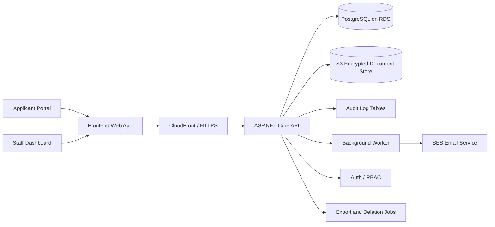

# Application Portal Proposal Pack

## Recommended Tech Stack

Your current instinct is sound. For this project I would recommend:

- Backend: `.NET 8` with `ASP.NET Core Web API`
- Frontend: `Next.js` with TypeScript for the production build, or `Razor/Blazor` if you want to stay all-in on .NET
- Database: `PostgreSQL`
- Cloud: `AWS`
- File storage: `Amazon S3` with server-side encryption
- Identity and secrets: `AWS Cognito` or ASP.NET Identity plus `AWS Secrets Manager` / `AWS KMS`
- Background jobs: `.NET Hosted Services` or Hangfire

Why this stack fits:

- `.NET 8` is strong for structured enterprise workflows, policy-based authorization, audit-sensitive APIs, and background processing.
- `PostgreSQL` handles transactional workflow data well and is a good fit for row-level security and audit queries.
- `AWS` gives you S3, RDS, KMS, CloudWatch, WAF, SES, and CloudFront, which map directly to the requirements here.

## High-Level Architecture

## Backend Architecture

### 1. What backend language/framework?

- `ASP.NET Core .NET 8`
- Structure:
  - `API` project for controllers/endpoints
  - `Application` layer for workflow services and business rules
  - `Domain` layer for entities and state transitions
  - `Infrastructure` layer for PostgreSQL, S3, email, audit logging, and auth

### 2. What database?

- `PostgreSQL` on `Amazon RDS`
- Reasons:
  - strong relational modelling for stages and scores
  - transaction support for workflow consistency
  - row-level security support
  - JSON columns for audit metadata when needed

### 3. What AWS services?

- `CloudFront` for HTTPS edge delivery
- `AWS WAF` for baseline request protection
- `Elastic Beanstalk`, `ECS Fargate`, or `App Runner` for the API
- `RDS PostgreSQL`
- `S3` for uploads, exports, and generated ZIP packages
- `KMS` for encryption keys
- `CloudWatch` for logs and alerts
- `SES` for application emails
- `Secrets Manager` for credentials and key rotation

For a first production version, I would lean toward:

- Frontend on `S3 + CloudFront`
- API on `App Runner` or `ECS Fargate`
- Database on `RDS PostgreSQL`

That keeps operations simpler than Kubernetes.

## Role-Based Access Control

- Use claims/policy-based authorization in `.NET 8`.
- Define capabilities by action, not only by role names.
- Example policies:
  - `CanReviewEssay`
  - `CanScoreAcademics`
  - `CanVerifyDocuments`
  - `CanShortlist`
  - `CanScoreInterview`
  - `CanFinalizeDecision`
- Every endpoint checks policy server-side.
- The frontend only renders allowed actions, but the real enforcement is in the API and database query layer.

## Workflow State Machine

Use a real state machine rather than a free-text status field.

Suggested states:

- `EligibilityFailed`
- `Draft`
- `Submitted`
- `EssayReviewed`
- `AcademicsScored`
- `DocumentsVerified`
- `Shortlisted`
- `InterviewScored`
- `FinalApproved`
- `FinalRejected`
- `FinalStandby`

Transition rules enforce ordering:

- cannot score academics before submission
- cannot shortlist before essay review, academic scoring, and document verification are complete
- cannot enter interview scoring unless shortlisted
- cannot finalize until interview stage is complete

This logic sits in application services and is also reflected in database constraints where possible.

## Race Condition Prevention

For this system, race conditions are a real issue, especially with 5 staff users working in parallel.

Recommended controls:

- optimistic concurrency with a `row_version` / xmin-style check on application records
- assignment locks for review tasks
- one active edit session for academic scoring and final decisions
- unique constraints to prevent duplicate scoring records
- idempotency tokens on submission and export endpoints

Practical example:

- if two screeners try to shortlist the same applicant, the second save fails with a concurrency error and must refresh before acting

## POPIA Compliance Implementation

### Audit Logging

Log every sensitive action:

- logins and failed logins
- profile creation and updates
- consent capture
- document upload, download, and delete
- essay score entry
- academic score entry
- shortlist decisions
- interview scores
- final decisions
- exports
- deletion requests
- role/permission changes

Each log record stores:

- actor user ID
- actor role
- affected applicant or entity ID
- action name
- timestamp UTC
- IP address and user agent
- before/after summary
- correlation ID

Audit logs should be append-only and visible only to authorized admins/compliance reviewers.

### Encryption

In transit:

- HTTPS everywhere
- HSTS
- secure cookies

At rest:

- RDS encryption enabled
- S3 server-side encryption
- KMS-managed keys
- field-level protection for passport/ID numbers and similarly sensitive identifiers

### Data Export

- authenticated request by applicant or authorized admin
- background job compiles profile, scores, documents, consent records, and status history
- result delivered as a signed ZIP link with expiry
- export action fully audited

### Data Deletion

- retention schedule tied to application cycle
- soft delete first if the cycle is still under review
- hard delete or anonymize once retention period ends
- preserve non-identifying audit evidence where legally necessary

### Database-Level Enforcement

Use a layered model:

- app-level policies in `.NET`
- query-level scoping per role
- PostgreSQL row-level security for especially sensitive reviewer tables
- separate DB roles for app runtime, reporting, and background jobs

## Database Schema Outline

Core tables:

- `users`
- `roles`
- `user_roles`
- `application_cycles`
- `applicants`
- `applications`
- `eligibility_checks`
- `consents`
- `documents`
- `document_verifications`
- `essay_reviews`
- `academic_score_sheets`
- `academic_subject_scores`
- `shortlist_decisions`
- `interviews`
- `interview_scores`
- `final_decisions`
- `audit_logs`
- `export_requests`
- `deletion_requests`

Key design rule:

- keep each stage in its own table so auditability and permissions remain clean

## Revised Estimate and Timeline

### Demo / Mock System

Scope:

- applicant portal mock
- role-switched admin dashboard
- scorecard
- architecture and cost proposal

Estimated effort:

- `1 to 2 weeks`

### Full Production Build

Realistic estimate for the complete system:

- `12 to 16 weeks`

That assumes:

- one developer lead
- one UI pass
- no major external integrations beyond email/storage/auth
- stakeholder feedback cycles are reasonably fast

### Week-by-Week Milestones

1. Week 1: discovery, final workflow mapping, data classification, refined wireframes
2. Week 2: architecture, schema, RBAC model, POPIA controls, infrastructure plan
3. Week 3: authentication, user management, session handling
4. Week 4: eligibility gate, applicant profile, core submission flow
5. Week 5: document upload and validation
6. Week 6: essay review workflow and audit events
7. Week 7: academic scoring workflow and average calculations
8. Week 8: document verification and blockers
9. Week 9: shortlist dashboard and master scorecard
10. Week 10: interview workflow and scoring forms
11. Week 11: final decisions, acceptance/rejection/standby communication flow
12. Week 12: export, deletion, security hardening, UAT
13. Weeks 13 to 16: revisions, load testing, compliance signoff, training, deployment

## Cost Positioning

See `docs/cost-estimate.md` for the working AWS estimate.

For proposal discussion, the clean summary is:

- demo / pilot: around `$100/month`
- lean production: around `$200 to $400/month`
- stronger production setup: around `$300 to $700/month`
- seasonal annual infrastructure: around `$1,000 to $4,200/year`

These are early planning ranges, not final quotes. The main cost swing factors are RDS sizing, high availability choice, storage retained between cycles, and traffic volume.

## Handover

Handover should include:

- source code
- database schema and migrations
- deployment instructions
- environment variable list
- admin guide
- user guide
- architecture diagram
- API documentation
- POPIA/security implementation summary
- training session or recorded walkthrough

## Experience Positioning

If stakeholders ask about prior experience, answer carefully and credibly:

- say that the solution uses patterns proven in admissions, grants, recruitment, and internal workflow systems
- emphasize confidence in building role-segregated dashboards, scoring workflows, document review, and audit-sensitive data handling
- distinguish the demo from the hardened production implementation
